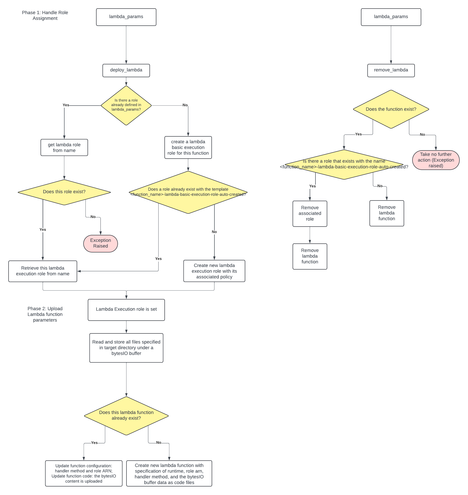

<h2>aws-deploy</h2>

<h3>Author: Abhinav Bichal</h3>

<p>This is the tool that I use to deploy any of the services I work on on AWS.</p>

<h3>About aws-deploy</h3>
<p><strong>Why did I make aws-deploy?</strong></p>
<ul>
    <li>Deploy services programatically to ensure reproducibility and consistency across platforms</li>
    <li>Get comprehensive details about each step of deployment and avoid "black box" logic</li>
    <li>And honestly just to learn a bit more about AWS and the more technical details about it</li>
</ul>

<h3>Getting Started</h3>

<p>Before using aws-deploy, first ensure that you are signed up for AWS. Either using the AWS CLI or writing in the details of the account manually.</p>

<i>Using the AWS CLI</i>
```
aws configure
# follow the prompt after
```

<i>Manually:</i>
~/.aws/credentials
```
[default]
aws_acess_key_id=<ACCESS_KEY_ID>
aws_secret_access_key=<SECRET_ACCESS_KEY>
```

<p>Also ensure that this AWS account has general settings for the service you want deployed allowed (or else aws-deploy will not work). Preferrably, you would use this tool for personal development where you have Admin access to your
AWS account. If not, ensure that the specific features you need working are also permitted through you IAM access.</p>

<p>With the settings properly configured, boto3 is able to function and this API will effectively wrap boto3 function calls for deploying any of your services.</p>

<h3>Using aws-deploy</h3>

<p>For each aws_deploy service, you are given two options for managing your AWS resources:</p>
<ul>
    <li>deploy</li>
    <li>remove</li>
</ul>

<p>For example, take a look at these various functions:</p>


```
from aws_deploy.functions import deploy_lambda, remove_lambda

from aws_deploy.gateway import deploy_api_gateway, remove_api_gateway

from aws_deploy.dynamodb import deploy_dynamodb, remove_dynamodb

(...)
```

<p>For each of these functions, you are to pass in a params object. This params object is like a template for you to fill out with all the necessary deployment details for boto3 to parse.</p>

<p>Here is an example with lambda:</p>

```
from aws_deploy.functions import deploy_lambda
from aws_deploy.params import LambdaParams

params = LambdaParams()
params.function_name = 'gateway_function'
params.code_folder_filepath = os.path.join(base_path, 'tests', 'test_data')
params.handler_method = 'gateway_function.lambda_handler'
params.deployment_package_files = ['gateway_function.py']

deploy_lambda(params)
```

<p>Similarly, for removing a certain lambda function (or any other service), you also pass in a params object. Note that you do not have to fill in everything for a removal function, and simply the identifier of that function will suffice.</p>

```
from aws_deploy.functions import deploy_lambda
from aws_deploy.params import LambdaParams

params = LambdaParams()
params.function_name = 'gateway_function'

remove_lambda(params)
```

<p>In that way, resources in aws_deploy are primarily specified by their name. If you have conflicting resource names in aws_deploy, note that unexpected behaviors may occur because boto3 will not be able to handle name conflicts without futher identification parameters.</p>


<p>For now, because these services are still under development (and I am the only solo dev on this), concrete examples of function usages will be found in the tests directory. The following images are deployment flowcharts which give more clarity to the internal details of how aws_deploy services specifically work. Note that this documentation is still subject to change.</p>


---
Functions deployment diagram
